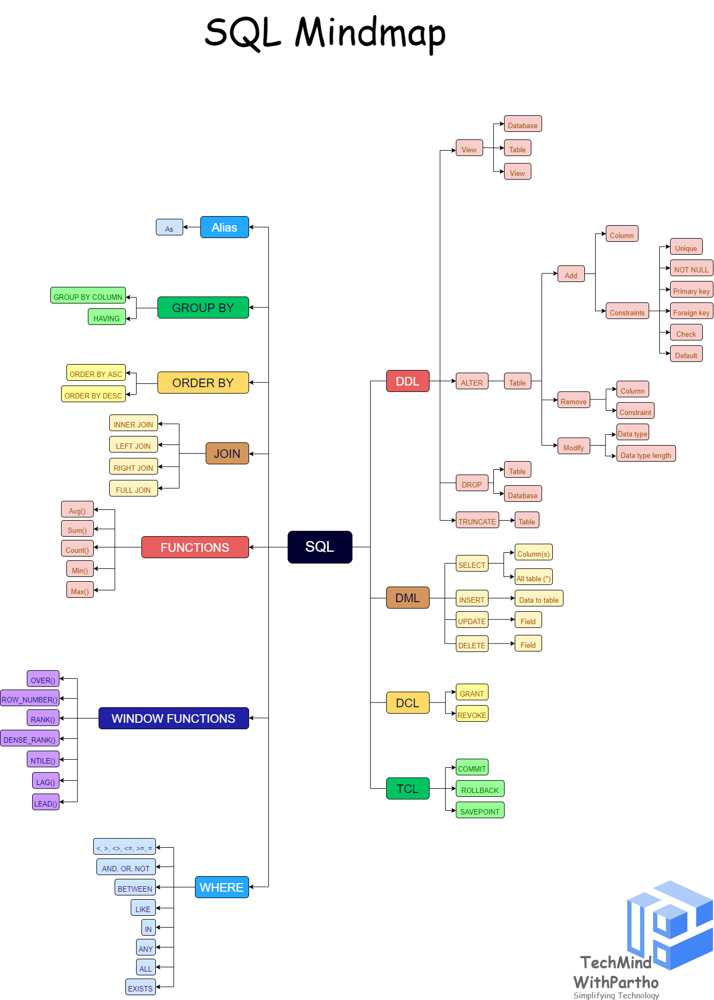
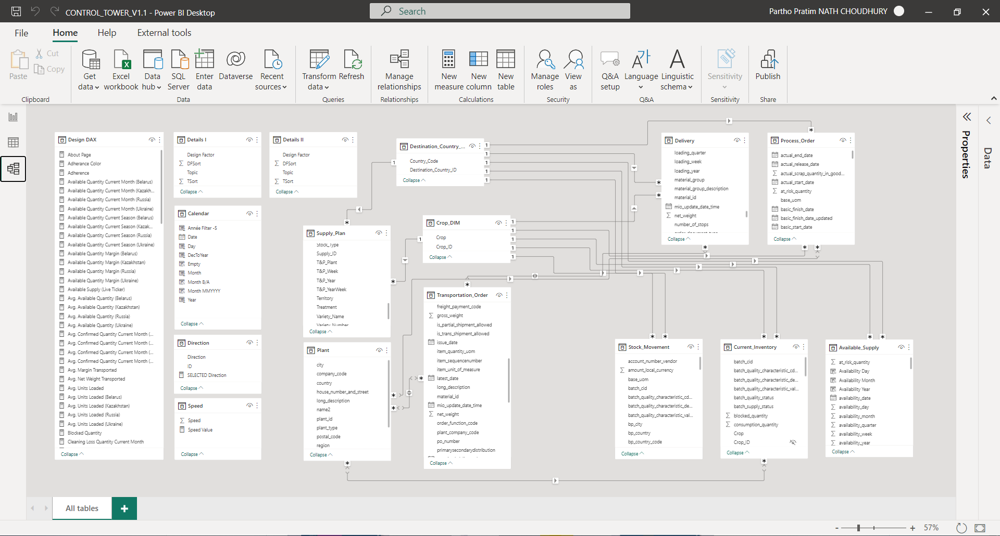
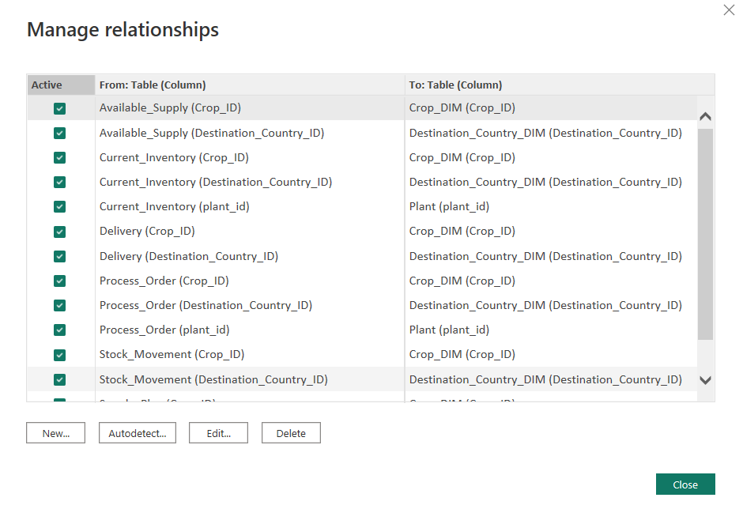
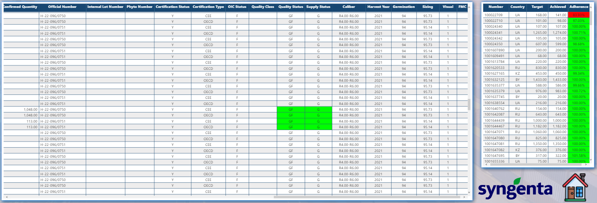

# Revolutionizing Data Management: A Digitized Solution for Europe, Africa, and the Middle East! :computer:
This project highlights the successful development and implementation of a web app in the OutSystems cloud infrastructure platform. The web app addresses the challenges of managing regional supply chain regulatory data with access compliance and automation, effectively transforming manual data entry and updates previously done on Microsoft Word and Excel for multiple languages across Europe, Africa, and the Middle East.

The project encompassed various stages, starting with designing the app and building the databases, followed by rigorous development, integration, and testing in a development environment. Continuous integration ensured the app's stability and reliability. Finally, the app was deployed in the production environment, making it accessible to end-users.

## > :rocket: **Thank you for your interest in my work.** :blush:

The solution developed is a web application built on the OutSystems cloud infrastructure platform with a fully aligned database. This solution addresses the problem of manual data entry and update processes that were previously done in Microsoft Word and Excel for managing regional supply chain regulatory data.

By transforming these manual processes into a digital web application, we have solved several problems:

**1. Elimination of Manual Data Entry:** The web app eliminates the need for manual data entry in Word and Excel, which can be time-consuming, error-prone, and inefficient. It provides a more streamlined and automated process for entering and updating regulatory data.

**2. Improved Data Accuracy and Integrity:** With the web app, data entry and updates are done digitally, reducing the risk of errors, and ensuring data accuracy and integrity. This is crucial for regulatory compliance and maintaining the quality of supply chain data.

**3. Multilingual and Multinational Support:** The web app caters to multiple languages belonging to multiple countries in Europe, Africa, and the Middle East. It enables users to input and access regulatory data in their respective languages, accommodating diverse regional requirements.

**4. Access Compliance and Security:** The web app ensures access compliance by implementing security features such as access controls, monitoring, and data protection. This addresses the need for secure handling of regulatory data, safeguarding sensitive information from unauthorized access or breaches.

**5. Automation and Efficiency:** The digital transformation of manual data entry and update processes brings automation and efficiency to supply chain regulatory data management. Tasks that were previously time-consuming and labor-intensive are now streamlined, saving valuable resources, and improving productivity.

Overall, this web app solution solves the problem of manual data entry, outdated tools, and inefficient processes for managing regional supply chain regulatory data. It provides a centralized, accessible, and secure platform for digitally transforming the way data is handled, ensuring compliance, accuracy, and efficiency in managing regulatory requirements across different languages and countries.

## How OutSystems solves the problem 📊

OutSystems is a modern application platform that simplifies every stage of the app development and delivery process. Developers and teams can provide apps the business requires at the speed the market demands.

Development teams design, develop, QA and analyze and manage their apps, no matter the size. All front-end and back-end development needs are covered. It also handles deployment and long-term maintenance. No one has to piece together separate tools, which can add cost and reduce productivity. And, we offer governance and impact analysis so big projects can get even bigger without requiring additional coding or management. 

Visual, model-driven development is at the core of the OutSystems platform, but there is so much more than that. OutSystems provides everything an organization needs to build applications fast, right, and for the future. The goal is to reduce costs and risks by enabling continuous deployment  across all platforms without breaks in the lifecycle by providing:

- Rapid productivity throughout the application lifecycle: You create your apps and integrate in weeks or less, not months.
 
- Speed and code: Developing with a visual model while retaining complete flexibility to integrate custom code enables extensibility, efficiency, and accelerated development.
  
- Multexperience development: Develop an application that can run on any device or platform. Risks, development time and costs are significantly reduced with error-free, automated deployments.
  
- Open platform: Protect your investment in large back end systems by integrating with existing systems of record and/or data sources.
  
- Enterprise-grade platform: Build and manage very large portfolios of applications created by teams of developers just as easily and quickly as a single app.
  
- Reduced costs: Reduce the costs of application maintenance to a fraction with automated dependency management and holistic application lifecycle management (ALM).
  
- No lock-in: No runtime interpreters or engines are required to enable OutSystems applications. The platform generates apps with a standard architecture.

**Rapid productivity**

OutSystems is designed from the ground up to accelerate not only the development of applications but also the process of changing them. Developers use visual, model-driven development, which reduces time and costs and improves agility. Elegant and engaging multiexperience user interfaces (UIs) harness the power of HTML and CSS, no deep expertise needed. Development is done without the headaches and inconsistencies of hand-coding and deployment is done with one click. Applications can be delivered in weeks or even days, not months or years. 

In traditional application development, the change process often slows productivity significantly. OutSystems platform, however, automates this process. It tracks global dependencies and pinpoints the impact of a change across all layers of an application, thereby minimizing costs, time and risks. It heals the sections that can be automatically corrected and provides notifications of any required manual corrections. It has the capability to display application portfolios visually so architects and others can identify where problems might lie and what they can do about it. The result is error-free build packages that ensure production upgrades are done in minutes with no impact on the quality of running applications.

OutSystems also enables organizations to avoid the traditional delays and cost overruns associated with integration. Pre-built connectors, REST APIs, SOAP web services and custom APIs accelerate the integration of back-ends. Customers say, “OutSystems integrates with anything I need inside my enterprise."

Even application management is rapid because organizations have full visibility and control of their applications. OutSystems provides a centralized console for managing versions, releases, deployments, and component dependencies across multiple environments. Delivery is streamlined because there is no need for complex configuration tools. Organizations do not have to worry about build and version control, nor find the experts to set them up. 

IT departments benefit from a default standard architecture and a well-designed visual modeling language with no dialects. Therefore, it is easy to transfer knowledge between developers in about 2 weeks even without additional documentation. This accelerates projects while allowing complete flexibility to outsource development with the knowledge that maintenance can be picked up at any time. A single developer is not indefinitely attached to a piece of mission-critical software and IT can bring new members into the team with the confidence that applications will never become an unmaintainable legacy. 

**Speed and code**

OutSystems uniquely combines development speed with seamless integration of custom and existing code for greater agility. Developers design the UI, business processes, business logic and data models for applications visually. Dragging and dropping functionality into a visual development environment provides greater agility than traditional hand coding. There is support for mashing up all components, including multiple sources of data, user interface blocks, APIs, integration connectors and business rules. This enables the agile creation of high-quality applications and processes in a fraction of the time it would take to build them with traditional solutions. 

At any time, developers can extend the visual models with custom code or new integration connectors for those instances when business applications require access to low level SDKs or weave in external micro-services or data sources.

But speed and control are not confined to development. With OutSystems, fast and secure deployment and change during the entire application lifecycle is just a click away. No matter how much an app is modified, OutSystems automates, manages and governs the change process to ensure deployment is error free. This even applies to deep changes to an application's data model, APIs and architecture.

OutSystems tracks and pinpoints the impact of a change across all layers of your application, thereby minimizing costs, time and risks. It automatically corrects most problems and notifies teams if manual corrections are necessary. It also automates the deployment process, including all database change scripts. The result? Error-free, low-cost build packages that assure your production upgrades are done in minutes with no impact on quality.

**Multiexperience  development**

OutSystems enables organizations to develop quality applications once and deploy them everywhere in much less time and at a lower cost than traditional technology. A full spectrum of devices and operating systems are supported without sacrificing native responsiveness. 

Once someone develops an app with OutSystems, it’s ready for all devices. The power of HTML and CSS are harnessed without hand coding, which significantly reduces errors, effort and development time. There’s no need to master constantly changing technology or hire expensive and scarce experts with device-specific knowledge.

It is easy to add native capabilities like geolocation, camera, notifications and on-device app integration to meet the needs of the business. And extending mobile apps to full browsers is effortless and risk free. 

People can even develop apps, such as progressive web apps (PWAs), that work offline as quickly and easily as online apps with just one click. 
Multiexperience development also means being able to develop an app and not having to worry about version changes and updates - or the high costs and risks involved - when new devices or platforms emerge. Each new version of the OutSystems regenerates existing applications to run on the latest versions of browsers, application server stacks, database engines, and mobile operating systems. Not only that, but OutSystems also packages mobile applications developed with the platform so they meet the requirements of the App Store and Google Play. 

Because of these OutSystems capabilities, customers can take advantage of constantly improved code and architecture patterns that continuously enhance security, scalability and performance of applications. They do not have to worry about rewriting apps for new technology and they can bypass the Apple Store or Google Play approval processes that can cost time and money. 

Changing applications is the same as developing new ones. OutSystems instantly serves application changes to user devices. When a new application or version is released, all users will have immediate access to it without having to install or update anything. If an organization finds a bug that puts data or users at risk, they can immediately correct it and deploy a new version of the application that works on all devices and platforms.

**Open platform**

OutSystems is an open unified platform that provides standards-based code and extensibility, because we know that proprietary data and architecture can limit application development and increase costs. We provide an open platform that can connect to any database and easily integrate with mission-critical systems.

OutSystems offers an expressive visual language for developing applications and avoiding rapid application development pitfalls. The application visual models designed with OutSystems are compiled into standard, well-architected, and optimized code (Javascript, HTML, CSS, C#, and standard SQL). This means they can be deployed in standard application server environments, in private clouds or your own data centers.

Visual models can be extended with standard or custom code such as JavaScript, CSS and HTML, Cordova plugins, C# and SQL. Developers can standardize around SOA and microservices. They can also integrate their apps with external databases and existing systems—even testing and monitoring tools. There are no limits on the types and sizes of applications that can be created.

The OutSystems Forge living repository contains open source extensions that include wrappers to public open source SDKs, libraries or plugins. These extensions and wrappers can be used throughout your applications, so there’s no need to spend the time or expense to build something that already exists.

For data access, OutSystems connects out-of-the-box to SQL Server, Oracle, MySQL and DB2. In addition, developers can implement a database connector to any database. They can write complex queries to an existing or imported database as part of an organization's pages, business logic or workflows. Standard SQL can be used to query the database that is being targeted.

For integration with SAP and other mission-critical systems, OutSystems provides prebuilt connectors (e.g. for SAP BAPIs RFC access) or provides rapid REST or SOAP integration capabilities. No hand-coding is needed, which reduces costs and accelerates productivity. For REST APIs, OutSystems automatically creates an interface that can be dragged around in the visual logic, as with any other piece of business logic or web service. For SOAP web services, OutSystems will create all the necessary data structures for the web service methods to be used visually.

**Enterprise-grade platform**

OutSystems is now considered one of the best in class for enterprise application requirements. Large enterprises use it to deploy mission-critical applications, point-of-sale and mobile customer engagement. So, whether an organization needs to create an application for employees, business partners or customers, OutSystems is ready to deliver—fast and cost-effectively.

OutSystems is continuously scalable to provide support for large portfolios of innovative, quality applications for line of business and core business processes. The flexible environment and governance features of OutSystems enable agile growth to a large well-designed and well-managed enterprise installation with hundreds of services and applications. 

OutSystems can support as many developers and teams as are needed to get the job done without sacrificing performance or agility. Modularization, packaging, distribution and deployment of reusable components and services enable small and large teams to design maintainable large-scale SOAs with agility. Assets become modules that can be mashed up to enable dependency tracking and reuse, saving time, expense and effort. The delivery pipeline is automated for all the dependencies, ensuring a composite app is always consistent.

OutSystems makes it extremely easy to integrate any external enterprise system, database or custom app with speed and extensibility. It provides seamless, out-of-the-box integration of enterprise data, third-party services, and custom apps. Pre-built connectors enable rapid integration with enterprise services and databases such as Salesforce, SAP, Oracle and more. And, developers can create, modify and extend their own custom integrations as needed.

OutSystems includes APIs to integrate the deployment of OutSystems applications with your existing DevOps tools and processes. 

**Reduced costs**

OutSystems supports broad and complex lifecycles, enabling a continuous deployment process the moment a project starts. We make it as easy to manage and update applications as it is to deploy them. Throughout the lifecycle, OutSystems works behind the scenes to ensure that applications are error-free. Applications are both instrumented for performance and quality and their architectures can be viewed in the OutSystems Architecture Dashboard, making it easy to pinpoint any part of an application or portfolio that needs to be corrected or optimized. Performance or quality problems are detected early and resolved quickly, which lowers development and deployment costs.

High-level security governance for applications and services enables our customers to define ownership, reuse, management and ops rules for a federated app development approach. Documentation is automated and back-office configuration services are centralized. Business process instances of operation and business activity monitoring are included. And, integration with mobile device management and mobile application management tools, such as Airwatch, enables mobile app governance.

These centralized and automated management features keep costs down because much less time and fewer people are needed to manage and operate mission-critical apps. Staging across environments is automated with no downtime and, if there is an issue, rollback is also automated. Full dependency tracking across apps and services ensures consistency. As a result, our customers have been able to perform multiple complex deployments per day without breaking the bank.

**No vendor lock-in**

It's important to know what will happen to apps developed in OutSystems if vendor and platforms change. For worry-free and risk-free implementation, OutSystems is the only solution that truly offers "no lock in”.

OutSystems doesn't use a proprietary runtime engine to run applications. Instead, OutSystems takes application models and generates standard applications that ultimately don't require OutSystems to run.

The visual model data artifacts map directly into database native concepts without extra metadata. OutSystems enables access to the data through any standard ETL, BI or other third-party database tool.

The code of the applications is also generated towards a target standard architecture - e.g. ReactJS in the frontend, C# in the backend - that we continuously evolve to address new architectural best practices and optimized performance.

OutSystems takes care of all the steps required to generate, optimize, compile, and deploy applications into a standard web application server. Organizations don’t have to use expensive resources to handle them.

This provides customers with the assurance that, if they ever stop using OutSystems, their IP is not lost, and applications will continue to run as-is in their own environment.

The OutSystems architecture is a layered ecosystem that enables developers to build applications fast, build them right, and build them for the future.💯_

## Infrastructure architecture and deployment options 💡

The OutSystems architecture is a layered ecosystem that enables developers to build applications fast, build them right, and build them for the future.

The top layer of the architecture includes tools, a repository, builders, processes, and components that simplify challenging aspects of integration. These architecture components help manage the software development life cycle (SDLC).

Underpinning this architecture are services for automating complex change management and architectural review processes, removing repetitive tasks and guesswork involved in application development, security, code generation, and logging. The runtime layer offers the option of deployment either in the OutSystems Cloud or on your systems.

**Standard, reliable technologies**

OutSystems runs on standard and scalable technology and doesn't need particular runtime engines or interpreters. It takes the visual application models you develop and generates a standard, optimized set of server (.NET) and client components (HTML, CSS, JavaScript) deployable to standard application servers.

With OutSystems, you deploy standard client-server architectures on the OutSystems Cloud, your on-premises servers, or public clouds such as AWS or Azure.

Application deployment is on IIS application servers running Microsoft Windows Server.

Standard relational databases store application data and Platform Server metadata that your applications use. The currently supported database management systems are Microsoft SQL Server, Azure SQL Database, and Oracle. You can also integrate with other databases.

# Environment architecture ⚖

An OutSystems environment provides all the necessary infrastructure to allow you to develop and deliver applications. The available editions have at least three environments suited for development, test, and production.

An environment includes a fully functional set of components that allow you to:

- develop visual code and integrations
- compile and deploy the code
- access and use the deployed applications in a browser or mobile device simulator

Environment deployment uses several underlying infrastructure components.

- One or more application servers for the app runtime.
- A database to store metadata and app data.
- An OutSystems Platform Server installation.

#### **Application Server**

Each environment has dedicated application servers running multiple applications. App deployment is on Microsoft IIS and Windows Server.

At runtime, virtual directories map onto application domains. Multiple application domains run in a worker process.

**Database**
You can choose to deploy your environment databases on Microsoft SQL Server, Azure SQL Database, or Oracle. For SQL and Azure databases, you need to configure three catalogs, and for Oracle, three schemas:

- Platform database
- Log database
- Session database

The catalogs or schemas can reside in the same database instance or server. Distinct environments have distinct catalogs or schemas. Non-production environments often share the same database server, so the different schemas help maintain separation between them.

You have the flexibility to choose which environments should have dedicated database servers. As the best practice, you should deploy dedicated database servers in production environments:

# Integration with external databases 📜

To build applications using existing data sources, use OutSystems Integration Builder. Supported databases are:

- SQL Server
- SQL Azure
- Oracle
- MySQL
- PostgreSQL
- DB2 iSeries

Developers can combine local and external data sources without spending unnecessary time on complex integration projects.

### **SQL Mind Mapping for Advanced Data Analytics !**

*How do you explain mind mapping?*

- A mind map involves writing down a central theme and thinking of new and related ideas which radiate out from the centre. By focusing on key ideas written down in your own words and looking for connections between them, you can map knowledge in a way that will help you to better understand and retain information.

  

<b>Mind Map:</b> Mind Mapping for Better Understanding of SQL.

# Data Model Optimization 🚶‍♂️ 

## 💾 **Initial: Prepare the Data Model for Analytics and Effective Transformation**

The model is designed following the best practices for better performance of data. As you can see below, the rules are segmented into categories. Some rules are more aesthetic-oriented while others are more focused on performance optimization. Note that there are several rules which require running an additional script.

**DAX Expressions**
- Use the DIVIDE function for division.
- Avoid using the IFERROR function.
- Column references should be fully qualified.
- Measure references should be unqualified.
- Measures should not be direct references of other measures.
- No two measures should have the same definition.
- Use the TREATAS function instead of INTERSECT for virtual relationships.

**Error Prevention**
- Data columns must have a source column.
- Calculated columns must have an expression.

**Formatting**
- Add data category for columns.
- Do not summarize numeric columns.
- First letter of objects must be capitalized.
- Hide fact table columns.
- Hide foreign keys.
- Mark primary keys.
- Month (as a string) must be sorted.
- Objects should not start or end with a space.
- Percentages should be formatted with thousands separators and one decimal.
- Format flag columns as Yes/No value strings.
- Provide format string for “Date” columns.
- Provide format string for “Month” columns.
- Provide format string for measures.
- Relationship columns should be of integer data type.
- Whole numbers should be formatted with thousands separators and no decimals.

**Maintenance**
- Ensure tables have relationships.
- Objects with no description.
- Remove data sources not referenced by any partitions.
- Remove roles with no members.
- Remove unnecessary columns.
- Remove unnecessary measures.

**Naming Conventions**
- Use CamelCase for hidden columns.
- Partition name should match table name for single partition tables.
- Object names must not contain special characters.

**Performance**
- Avoid bi-directional relationships against high-cardinality columns.
- Avoid excessive bi-directional or many-to-many relationships.
- Avoid snowflake schema architecture.
- Do not use floating point data types.
- Large tables should be partitioned.
- Limit row level security (RLS) logic.
- Many-to-many relationships should be single direction.
- Minimize Power Query transformations.
- Model should have a date table.
- Model using Direct Query and no aggregations.
- Reduce number of calculated columns.
- Reduce usage of calculated columns that use the RELATED function.
- Reduce usage of calculated tables.
- Reduce usage of long-length columns with high cardinality.
- Remove auto-date table.
- Remove redundant columns in related tables.
- Set IsAvailableInMdx to false on non-attribute columns.
- Split date and time.
- Date/calendar tables should be marked as a date table.
- Unpivot pivoted (month) data.

  

<b>Scenario 7:</b> The Data Model behind the Transformation.

While setting up my data model, I started by organizing my tables. As you can see in the image above, one of the best ways to do this is by using the Waterfall technique. Another way to do this effectively is by using the Star Schema approach. 

  
   

<b>Scenario 8:</b> Example of the Data/Table Relationship.

The Manage Relationships dialogue also makes it easy to view the cardinality and its direction.

Ideally, relationships can either be one-to-many or many-to-one. Power BI is excellent at defaulting the cardinality according to your data.

## Results and Next Steps 💯

  
  

<b>Test 1:</b> 'Country_1', 'Country_2', 'Country_3' & 'Country_4' Order Lines alligned with Seasonal Line Production.

- **Best Performance:** Production for the Season Alligned with the Supply Requirements/Alligned with KPI's: >=95% "Green", >=90% && <95% "Yellow"
, and <90% "Red"
- **Supply Plan vs. Distribution Allignment:** Clustering for Data based on the Monthly Plan for the Season, 92% alligned with the Distribution.
- **Current Inventory based of the Inventory Report Date:** Availability of the Inventory Data for the latest report date is alligned.

**Next Steps:**
To estimate the impact of wave loading strategy on the supply productivity, we will run several simulations with a gradual number of orders per wave:
1. Evaluate the Production KPI based on Customer Needs and Divert the Flow based on Predictions: How much is required more to fulfill the next allignment, what is required?
2. Record Picking Route per Wave: Recording the sequence of locations per route for further analysis based on advance predictions.

# **Use the application** 🖥️ 
> This app has been deployed internally.

#### **Why should you use it?** 
> This Power BI Cloud/Service Application has been designed for **Regional Business Leadership Team** to help them simulate the impact of data optimization in analyzing the Supply Plan Execution with the Distribution and Production.

#### **Load the data**

- You cannot use the dataset of this project due to business security reasons.
- You can build your own dataset following the step of ('Initial Step') above.

##### **Comment 1:** Scope

As the computation time can increase exponentially with the size of the dataset _(optimization can be done)_ you can change the model and the data load according to the need.

##### **Comment 2:** Fix the range of orders/loading wave to simulate

We can modify the model to run a loop testing scenario with the number of orders per wave varying between planned scenario and the executed scenario.

##### **Comment 3:** Start Calculation

- The MEASURE keyword introduces a measure definition (DEFINE) in a query (also known as query measure).
- The syntax after MEASURE defines a measure, which can be consumed in any other expression of the same query.
- A query measure overrides a model measure with the same name. However, its definition is only used in other query measures; other model measures continue to use the model measure definition.

- You can find the example DAX Queries used for this project in the folder:
[wave_loading_analysis/dax_solution_measures_examples.txt](https://github.com/ianthropos88/wave_loading_analysis/blob/main/dax_solution_measures_examples.txt)
- You can find DAX Overview in the folder:
[wave_loading_analysis/DAX_World/DAX_Overview.pdf](https://github.com/ianthropos88/wave_loading_analysis/blob/main/DAX_World/DAX%20Overview.pdf)
- You can find more advance DAX measures format in the folder:
[wave_loading_analysis/DAX_World/DAX_World.xlsx](https://github.com/ianthropos88/wave_loading_analysis/blob/main/DAX_World/DAX%20World.xlsx)

##### **Comment 4:** Moving Text

Up until now, elements in Power BI Reports didn't move. In most cases, this is perfectly fine. But sometimes you might want to add a moving text or image to get the user's attention. This can be done with the help of the HTML Text_Styler.

With the HTML Text_Styler, you can define the scroll direction, speed, number of times the text should move over the screen, and many other settings. Of course, you still have full flexibility when it comes to formatting.

On top of that, the statement can be designed to work for other objects so you can also let an image move across your screen.

- You can find the example HTML Text_Styler used for this project in the folder:
[wave_loading_analysis/html_text_styler_solution_code.txt](https://github.com/ianthropos88/wave_loading_analysis/blob/main/html_text_styler_solution_code.txt)

### **Final Results**

  
    

<b>Experiment 1:</b> Production Results.

💡 This is the same graph with the one presented in the article above. 

# About me 🤓
- With 10+ years of industry experience, I have thrived in Data Science, Data Governance, IT, Cloud and Product Management. I have a keen interest and expertise in solving business problems using unique logic and analytics. I bring solutions to the table based on competitive Business Acumen and Human Intelligence.
- Have a look at my portfolio: [Helping organization level all their Seeds Business arguments using Data & Technology | Ex_Zalando | Ex_Freecharge | Ex_Myntra Jabong | Ex_Supercell | Ex_Infosys](https://www.linkedin.com/in/pnchoudhury/)
- I love talking about #cloudarchitecture, #businessanalytics, #datapipelines, #machinelearning, and #artificialintelligence 
