# Revolutionizing Data Management: A Digitized Solution for Europe, Africa, and the Middle East! :computer:
This project highlights the successful development and implementation of a web app in the OutSystems cloud infrastructure platform. The web app addresses the challenges of managing regional supply chain regulatory data with access compliance and automation, effectively transforming manual data entry and updates previously done on Microsoft Word and Excel for multiple languages across Europe, Africa, and the Middle East.

The project encompassed various stages, starting with designing the app and building the databases, followed by rigorous development, integration, and testing in a development environment. Continuous integration ensured the app's stability and reliability. Finally, the app was deployed in the production environment, making it accessible to end-users.

## > :rocket: **Thank you for your interest in my work.** :blush:

The solution developed is a web application built on the OutSystems cloud infrastructure platform with a fully aligned database. This solution addresses the problem of manual data entry and update processes that were previously done in Microsoft Word and Excel for managing regional supply chain regulatory data.

By transforming these manual processes into a digital web application, we have solved several problems:

**1. Elimination of Manual Data Entry:** The web app eliminates the need for manual data entry in Word and Excel, which can be time-consuming, error-prone, and inefficient. It provides a more streamlined and automated process for entering and updating regulatory data.

**2. Improved Data Accuracy and Integrity:** With the web app, data entry and updates are done digitally, reducing the risk of errors, and ensuring data accuracy and integrity. This is crucial for regulatory compliance and maintaining the quality of supply chain data.

**3. Multilingual and Multinational Support:** The web app caters to multiple languages belonging to multiple countries in Europe, Africa, and the Middle East. It enables users to input and access regulatory data in their respective languages, accommodating diverse regional requirements.

**4. Access Compliance and Security:** The web app ensures access compliance by implementing security features such as access controls, monitoring, and data protection. This addresses the need for secure handling of regulatory data, safeguarding sensitive information from unauthorized access or breaches.

**5. Automation and Efficiency:** The digital transformation of manual data entry and update processes brings automation and efficiency to supply chain regulatory data management. Tasks that were previously time-consuming and labor-intensive are now streamlined, saving valuable resources, and improving productivity.

Overall, this web app solution solves the problem of manual data entry, outdated tools, and inefficient processes for managing regional supply chain regulatory data. It provides a centralized, accessible, and secure platform for digitally transforming the way data is handled, ensuring compliance, accuracy, and efficiency in managing regulatory requirements across different languages and countries.

## How OutSystems solves the problem! 📊

OutSystems is a modern application platform that simplifies every stage of the app development and delivery process. Developers and teams can provide apps the business requires at the speed the market demands.

Development teams design, develop, QA and analyze and manage their apps, no matter the size. All front-end and back-end development needs are covered. It also handles deployment and long-term maintenance. No one has to piece together separate tools, which can add cost and reduce productivity. And, we offer governance and impact analysis so big projects can get even bigger without requiring additional coding or management. 

Visual, model-driven development is at the core of the OutSystems platform, but there is so much more than that. OutSystems provides everything an organization needs to build applications fast, right, and for the future. The goal is to reduce costs and risks by enabling continuous deployment  across all platforms without breaks in the lifecycle by providing:

- Rapid productivity throughout the application lifecycle: You create your apps and integrate in weeks or less, not months.
 
- Speed and code: Developing with a visual model while retaining complete flexibility to integrate custom code enables extensibility, efficiency, and accelerated development.
  
- Multexperience development: Develop an application that can run on any device or platform. Risks, development time and costs are significantly reduced with error-free, automated deployments.
  
- Open platform: Protect your investment in large back end systems by integrating with existing systems of record and/or data sources.
  
- Enterprise-grade platform: Build and manage very large portfolios of applications created by teams of developers just as easily and quickly as a single app.
  
- Reduced costs: Reduce the costs of application maintenance to a fraction with automated dependency management and holistic application lifecycle management (ALM).
  
- No lock-in: No runtime interpreters or engines are required to enable OutSystems applications. The platform generates apps with a standard architecture.

**Rapid productivity**

OutSystems is designed from the ground up to accelerate not only the development of applications but also the process of changing them. Developers use visual, model-driven development, which reduces time and costs and improves agility. Elegant and engaging multiexperience user interfaces (UIs) harness the power of HTML and CSS, no deep expertise needed. Development is done without the headaches and inconsistencies of hand-coding and deployment is done with one click. Applications can be delivered in weeks or even days, not months or years. 

**Speed and code**

OutSystems uniquely combines development speed with seamless integration of custom and existing code for greater agility. Developers design the UI, business processes, business logic and data models for applications visually. Dragging and dropping functionality into a visual development environment provides greater agility than traditional hand coding. There is support for mashing up all components, including multiple sources of data, user interface blocks, APIs, integration connectors and business rules. This enables the agile creation of high-quality applications and processes in a fraction of the time it would take to build them with traditional solutions. 

**Multiexperience  development**

OutSystems enables organizations to develop quality applications once and deploy them everywhere in much less time and at a lower cost than traditional technology. A full spectrum of devices and operating systems are supported without sacrificing native responsiveness. 

Once someone develops an app with OutSystems, it’s ready for all devices. The power of HTML and CSS are harnessed without hand coding, which significantly reduces errors, effort and development time. There’s no need to master constantly changing technology or hire expensive and scarce experts with device-specific knowledge.

It is easy to add native capabilities like geolocation, camera, notifications and on-device app integration to meet the needs of the business. And extending mobile apps to full browsers is effortless and risk free.

**Open platform**

OutSystems is an open unified platform that provides standards-based code and extensibility, because we know that proprietary data and architecture can limit application development and increase costs. We provide an open platform that can connect to any database and easily integrate with mission-critical systems.

OutSystems offers an expressive visual language for developing applications and avoiding rapid application development pitfalls. The application visual models designed with OutSystems are compiled into standard, well-architected, and optimized code (Javascript, HTML, CSS, C#, and standard SQL). This means they can be deployed in standard application server environments, in private clouds or your own data centers.

**Enterprise-grade platform**

OutSystems is now considered one of the best in class for enterprise application requirements. Large enterprises use it to deploy mission-critical applications, point-of-sale and mobile customer engagement. So, whether an organization needs to create an application for employees, business partners or customers, OutSystems is ready to deliver—fast and cost-effectively.

OutSystems is continuously scalable to provide support for large portfolios of innovative, quality applications for line of business and core business processes. The flexible environment and governance features of OutSystems enable agile growth to a large well-designed and well-managed enterprise installation with hundreds of services and applications.  

**Reduced costs**

OutSystems supports broad and complex lifecycles, enabling a continuous deployment process the moment a project starts. We make it as easy to manage and update applications as it is to deploy them. Throughout the lifecycle, OutSystems works behind the scenes to ensure that applications are error-free. Applications are both instrumented for performance and quality and their architectures can be viewed in the OutSystems Architecture Dashboard, making it easy to pinpoint any part of an application or portfolio that needs to be corrected or optimized. Performance or quality problems are detected early and resolved quickly, which lowers development and deployment costs.

**No vendor lock-in**

It's important to know what will happen to apps developed in OutSystems if vendor and platforms change. For worry-free and risk-free implementation, OutSystems is the only solution that truly offers "no lock in”.

OutSystems doesn't use a proprietary runtime engine to run applications. Instead, OutSystems takes application models and generates standard applications that ultimately don't require OutSystems to run.

The visual model data artifacts map directly into database native concepts without extra metadata. OutSystems enables access to the data through any standard ETL, BI or other third-party database tool.

The OutSystems architecture is a layered ecosystem that enables developers to build applications fast, build them right, and build them for the future.💯_

  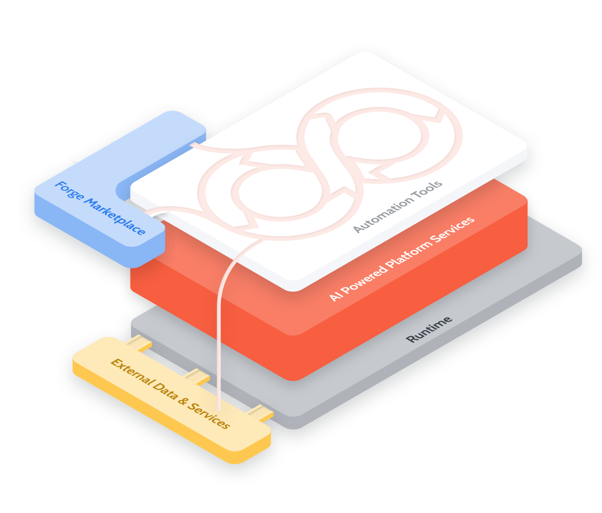

## Infrastructure Architecture and Deployment Options 💡

The OutSystems architecture is a layered ecosystem that enables developers to build applications fast, build them right, and build them for the future.

The top layer of the architecture includes tools, a repository, builders, processes, and components that simplify challenging aspects of integration. These architecture components help manage the software development life cycle (SDLC).

Underpinning this architecture are services for automating complex change management and architectural review processes, removing repetitive tasks and guesswork involved in application development, security, code generation, and logging. The runtime layer offers the option of deployment either in the OutSystems Cloud or on your systems.

**Standard, reliable technologies**

OutSystems runs on standard and scalable technology and doesn't need particular runtime engines or interpreters. It takes the visual application models you develop and generates a standard, optimized set of server (.NET) and client components (HTML, CSS, JavaScript) deployable to standard application servers.

With OutSystems, you deploy standard client-server architectures on the OutSystems Cloud, your on-premises servers, or public clouds such as AWS or Azure.

Application deployment is on IIS application servers running Microsoft Windows Server.

Standard relational databases store application data and Platform Server metadata that your applications use. The currently supported database management systems are Microsoft SQL Server, Azure SQL Database, and Oracle. You can also integrate with other databases.

# Solution Logic ⚖

In OutSystems, the logic of our applications is implemented through Actions. While developing our applications, I created own custom actions and used the actions to perform job:

OutSystems built-in actions: Actions that are defined by the platform and cannot be modified or inspected. We can use them in our action flows, such as Entity Actions, System Actions, or Role Actions.

Custom actions: The actions that we create to define our business rules, fetch data from the database, run integrations with external systems, among other operations.

Actions that handle System Events: Actions that run at specific moments of the application life cycle, such as when a web session starts or a mobile app resumes. I was able to design the flow of these actions according to our business rules.

  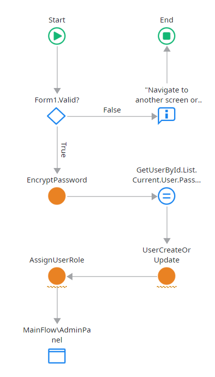

  

  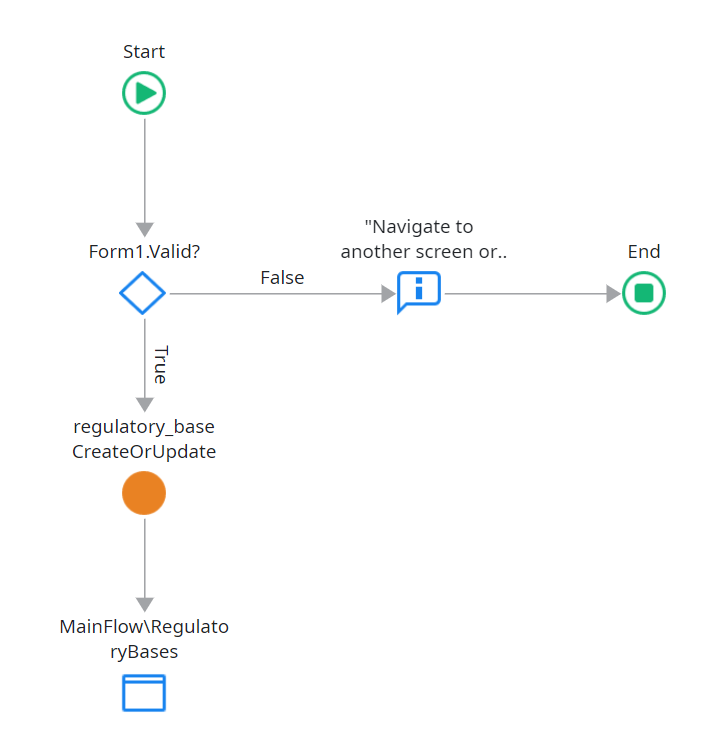

# Environment architecture ⚖

An OutSystems environment provides all the necessary infrastructure to allow you to develop and deliver applications. The available editions have at least three environments suited for development, test, and production.

An environment includes a fully functional set of components that allow you to:

- develop visual code and integrations
- compile and deploy the code
- access and use the deployed applications in a browser or mobile device simulator

Environment deployment uses several underlying infrastructure components.

- One or more application servers for the app runtime.
- A database to store metadata and app data.
- An OutSystems Platform Server installation.

  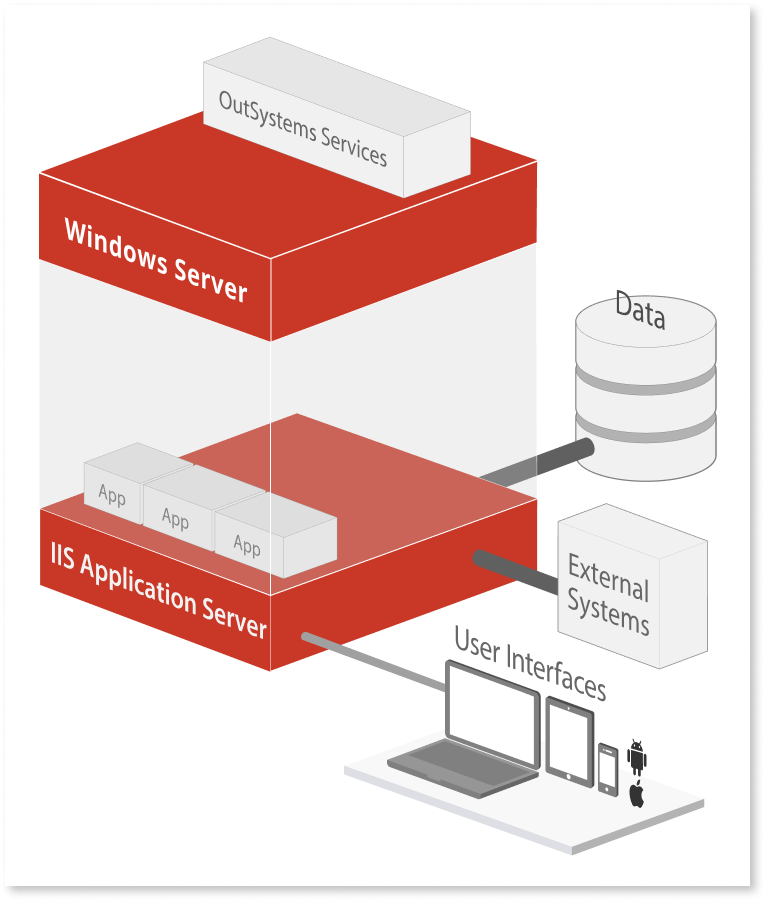

#### **Application Server**

Each environment has dedicated application servers running multiple applications. App deployment is on Microsoft IIS and Windows Server.

  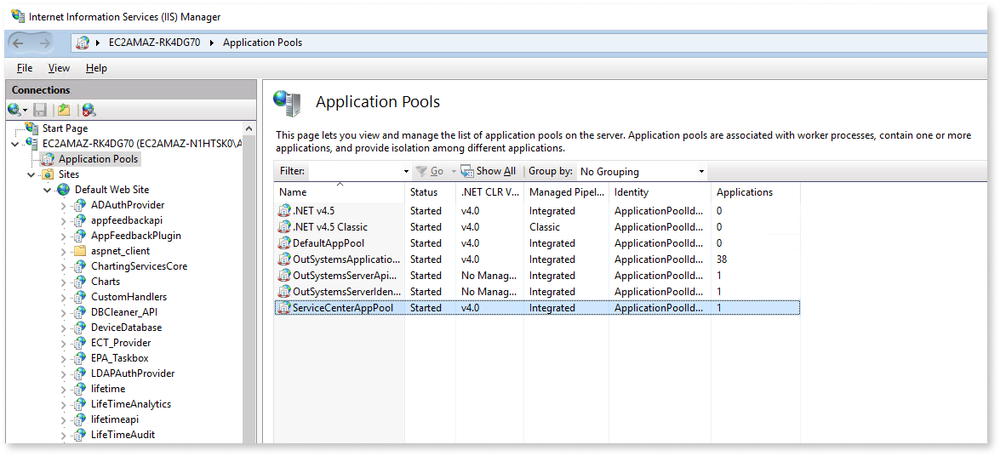

At runtime, virtual directories map onto application domains. Multiple application domains run in a worker process.

**Database**
You can choose to deploy your environment databases on Microsoft SQL Server, Azure SQL Database, or Oracle. For SQL and Azure databases, you need to configure three catalogs, and for Oracle, three schemas:

- Platform database
- Log database
- Session database

The catalogs or schemas can reside in the same database instance or server. Distinct environments have distinct catalogs or schemas. Non-production environments often share the same database server, so the different schemas help maintain separation between them.

  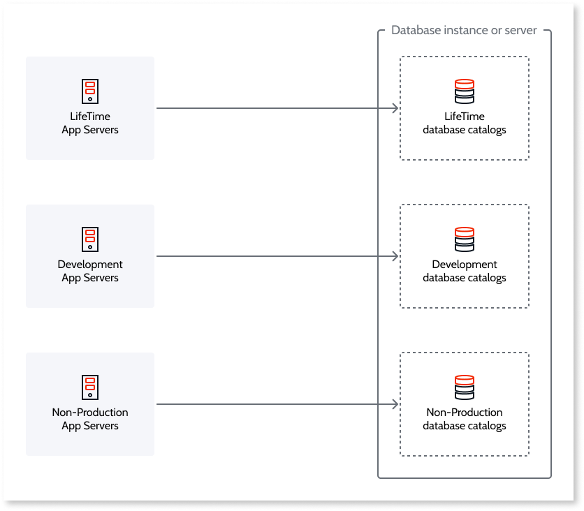

You have the flexibility to choose which environments should have dedicated database servers. As the best practice, you should deploy dedicated database servers in production environments:

  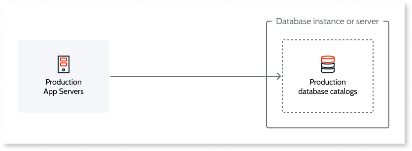

# Integration with external databases 📜

To build applications using existing data sources, use OutSystems Integration Builder. Supported databases are:

- SQL Server
- SQL Azure
- Oracle
- MySQL
- PostgreSQL
- DB2 iSeries

Developers can combine local and external data sources without spending unnecessary time on complex integration projects.

### **Platform Server**

The Platform Server in each environment orchestrates compilation, deployment, and management activities for all applications. Platform Server installation is on all application servers that compose an environment.

**OutSystems services**

The Platform Server installs specific OutSystems services that deliver the platform’s core functionality. They can either run as a Windows service, a .NET Core app managed by IIS, or as a library in the applications themselves.

- **Deployment controller service:** Enables the compilation of OutSystems applications and the automated deployment of the code to multiple servers.
- **Deployment service:** Enables the deployment of OutSystems applications in the current server.
- **Scheduler service:** is responsible for triggering asynchronous processes and manages timers, business processes, and emails.
- **Server.API:** responsible for exposing some platform functionality as services.
- **Server.Identity:** responsible for authenticating users and access control for the APIs exposed by the Server API.

# Standalone and server farm configurations 🚶‍♂️ 

As load increases and high availability needs become apparent, it’s possible to add application servers (also referred to as front ends) to scale environments horizontally.

A distributed environment architecture allows you to balance costs in non-production environments with a minimum set of servers while simultaneously horizontally scaling up highly loaded production environments. On the top access layer, support for load balancing removes single points of failure.

Two configurations, standalone and server farm, accommodate the differing needs of each environment.

**Standalone**

The usual architecture for non-production environments is standalone. In this configuration:

- Deployment of Apps is to a single application server.
- A single queue serves all requests.
- The database installation can reside on the same physical server as the application server or a dedicated physical server.

**Server farm**

The server farm uses automated resource optimization and management to ensure an application consumes few resources while freeing unused resources. It's a typical configuration for production environments and large non-production environments. In a server farm:

- Provisioning of multiple front-ends deals with increased load and high availability requirements.
- The OutSystems Deployment Controller service ensures that application installation is consistent across all front-end servers.
- Multiple queues handle service requests.
- This configuration requires a load balancer.
- High application hosting requirements would typically imply a dedicated database server.

## Infrastructure architecture

The OutSystems infrastructure is a set for environments that comprise the lifecycle of a portfolio of applications, managed using the LifeTime infrastructure management console. An OutSystems infrastructure includes the following components:

- **Environments for the product lifecycle management -** to deploy your infrastructure with a separate environment for each phase: development, functional testing, user acceptance testing (UAT), and production.
- **LifeTime management console -** manages the infrastructure, environments, applications, IT users, and security. A LifeTime deployment has a dedicated environment with a dedicated server, database catalogs, and a central console.
- **Pipelines -** to isolate applications based on common characteristics.
- **OutSystems SaaS tools -** that support optional functionality and accelerate app development.

  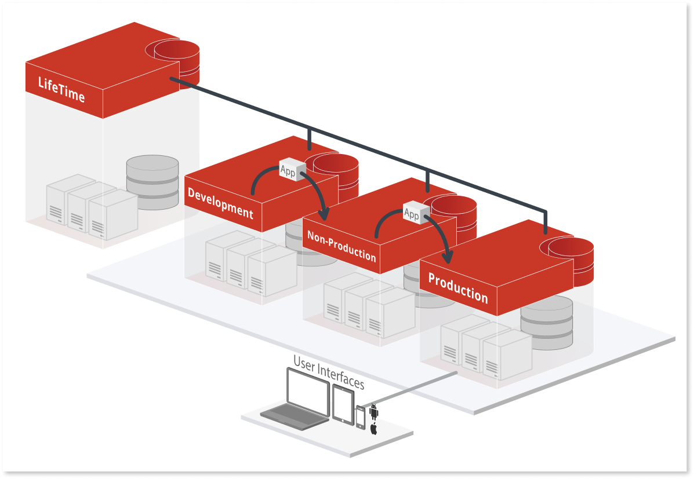

## Pipelines 💯

Not all apps have identical requirements; they have different business goals and non-functional requirements (NFR). With OutSystems, you have the option to deploy additional pipelines that allow you to isolate a portfolio of applications that have the same characteristics.

They include a set of environments to enable independent development and release. Pipelines can help you with governance, compliance, and maintaining quality standards by allowing you to:

- Isolate lines of apps with different lifecycle stages into pipelines. Each can have a different set of environments where one of the pipelines has an additional environment for an extra stage, such as mobile device testing.
- Group applications with similar scalability and high availability needs.
- Address compliance with data segregation policies with separate databases for more sensitive data.
- Isolate mission-critical apps. Pipelines help isolate your mission-critical applications, catering to data isolation and additional lifecycle stages (perhaps, extra testing).

All while maintaining the reusability of your components across an entire portfolio.

### **OutSystems SaaS tools**

Various SaaS tools provided by OutSystems are available. Installation of these isn't on your servers and requires connectivity to your OutSystems infrastructure. Connectivity is assured when using OutSystems Cloud, but on your self-managed infrastructure, you’ll need to be aware of this:

- **Mobile Apps Build Service:** generates mobile packages for installation on mobile devices.
- **AI Mentor Studio:** technical debt monitoring tool that enables you to visualize complex cross-portfolio architectures, identify problems, and help developers follow best practices.
- **Workflow Builder:** creates workflows to build apps for task management and automation.
- **Experience Builder:** prototype pixel-perfect mobile applications and turn them into production-ready apps.

  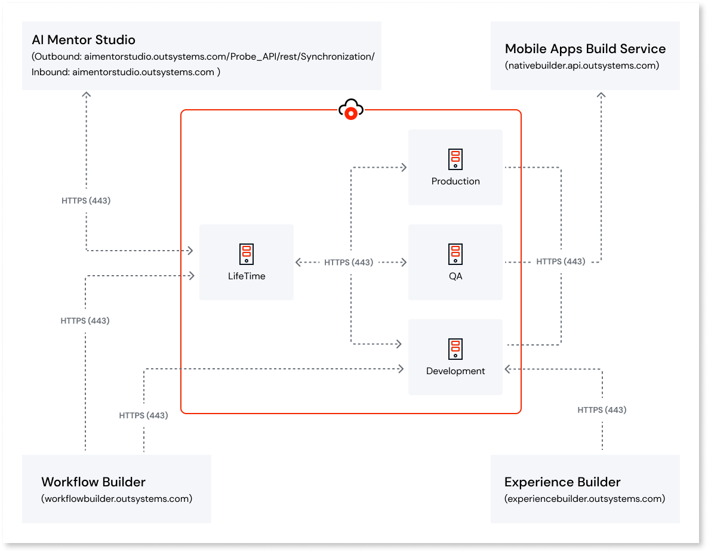

 ### **Infrastructure architecture examples**

 OutSystems provides the flexibility to start with simple infrastructure. Edition upgrades and scale-ups are available to accommodate growing needs. The following examples show different infrastructure architectures compositions, from simple to complex.

Addons are available in addition to the default configurations. Information on add-ons is available here.

**Basic edition infrastructure**

Use OutSystems Cloud's Basic edition to deploy departmental apps used only by your employees, such as an HR onboarding app.

These apps share a simple life cycle, so three environments and a single pipeline suit the needs. They aren’t mission-critical, so a high-availability setup is unnecessary.

  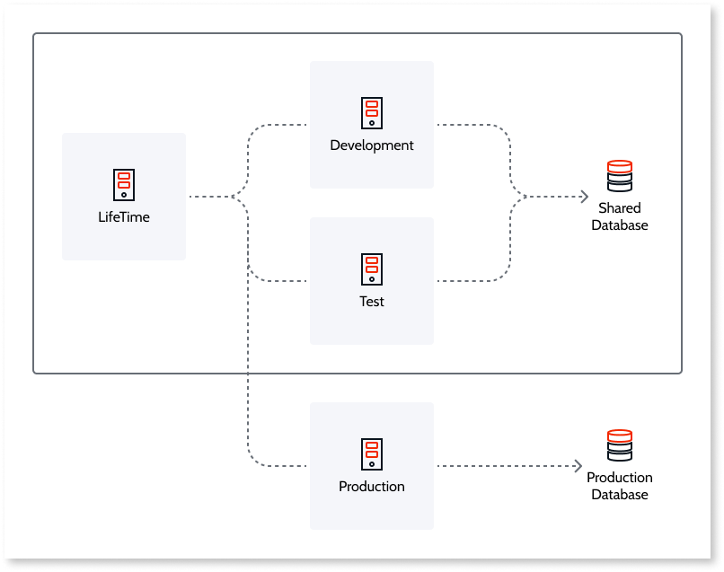

For this setup, use these underlying servers:

**Two database servers:**

- A shared database server or instance carries all the catalogs for the LifeTime, Development, and Test environments.
- A dedicated database server for the Production environment.

**Four front-end servers:**

- 1 for LifeTime
- 1 for Development
- 1 for Test
- 1 for Production

**Standard edition infrastructure**

Let's consider departmental sales and productivity apps and a mission-critical mobile banking app.

The lifecycle of this portfolio requires a stage for device testing, so the extra UAT environment supports it.

The mobile banking app requires extra front ends to support a B2C expected usage. A mission-critical application translates to a high availability infrastructure, so the distribution of front-ends is between two data centers, and the database has a stand-by replica.

  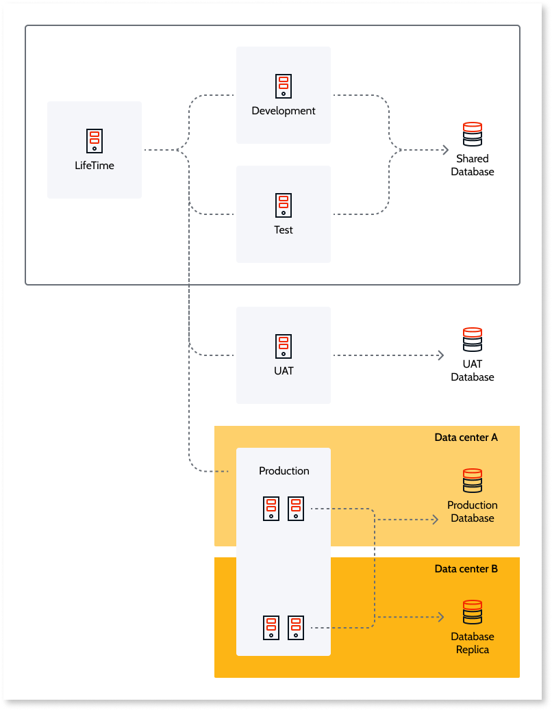

As a result, this factory required:

**Four database servers:**

- A shared schema or catalog server for LifeTime, Development, and Test.
- One dedicated to UAT.
- One for the Production environment.
- A standby database replica of the Production database

**Eight front-end servers:**

- One for LifeTime
- One for Development
- One for Test
- One for UAT
- Four for Production with a load balancer

**Enterprise edition infrastructure**

This scenario has a portfolio of departmental and external facing applications with different scaling needs, needing multiple pipelines. The external apps also handle sensitive data with strict policies requiring high availability.

The fundamental differences between the two portfolios require a split into two pipelines. One of the pipelines needs two front ends in Production, the other four front ends. The pipelines may require further scaling in the future. Any specific data access rules execute in one of the pipelines.

  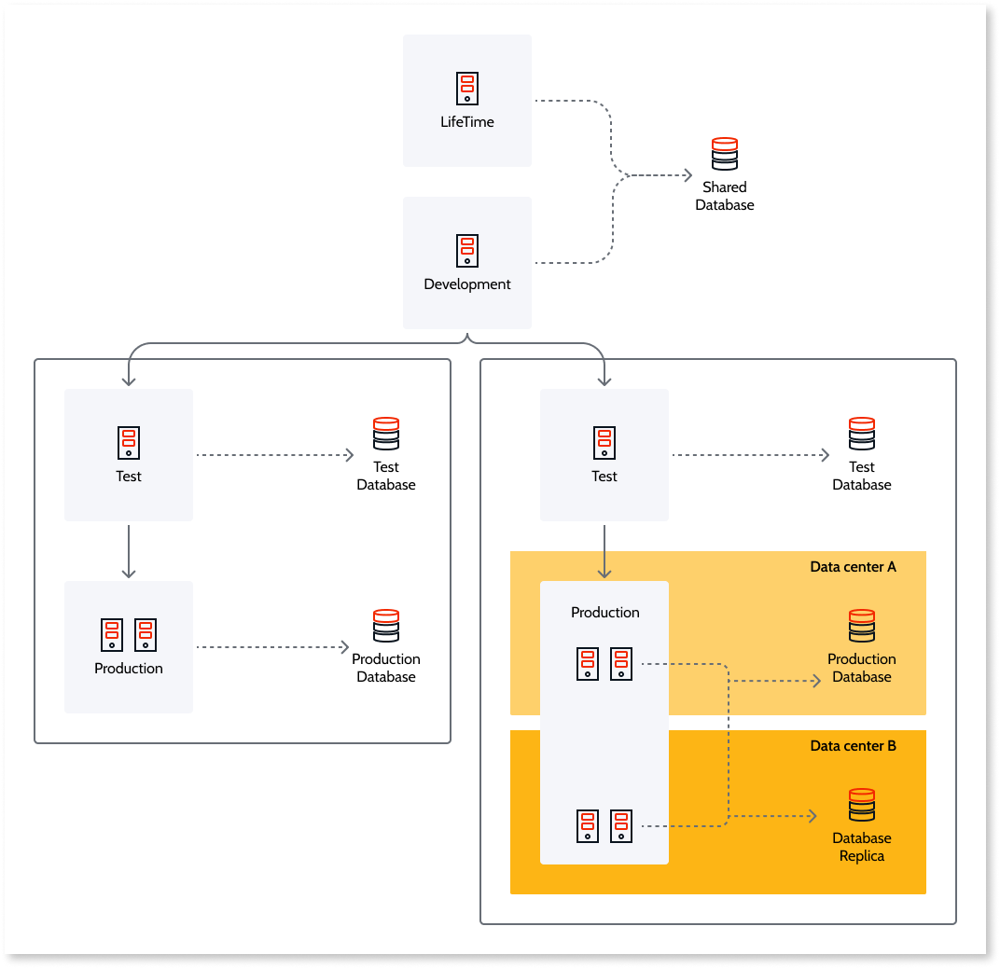

For this infrastructure, two pipelines are necessary:

**Six database servers:**

- One shared database server or instance with all the catalogs of LifeTime and Development.
- Two databases for the two test environments of both pipelines.
- One database server for the Production environment of the pipeline is on the left.
- Two database servers (primary and replica) for the Production environment of the pipeline on the right

**Ten front-end servers:**

- One for LifeTime.
- One in Development.
- Two for Test (one for each pipeline).
- 2 in the Production environment that hosts the departmental applications.
- Four for the Production environment comprising the mission-critical external facing apps.

## **Deployment options**

OutSystems builds on reliable technologies, and its scalable architecture allows adjustments of infrastructure configurations to your needs. OutSystems supports your infrastructure providers such as AWS and Azure. Application code and data are always under the customer’s control.

In the OutSystems Cloud, managed infrastructure frees developers to focus on developing applications on the OutSystems platform.

Deployment can be in a self-managed infrastructure, your data center, or a public cloud. You manage the runtime application server (IIS), and the operating system in these scenarios.

  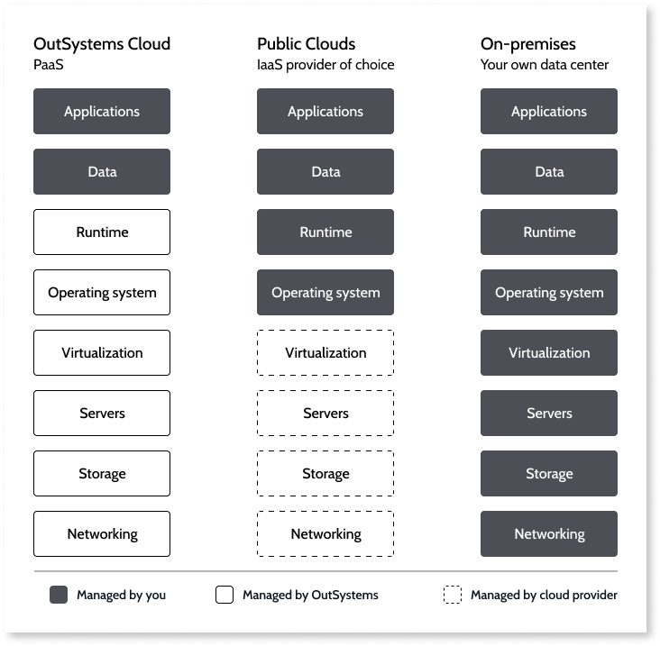

# About me 🤓
- With 10+ years of industry experience, I have thrived in Data Science, Data Governance, IT, Cloud and Product Management. I have a keen interest and expertise in solving business problems using unique logic and analytics. I bring solutions to the table based on competitive Business Acumen and Human Intelligence.
- Have a look at my portfolio: [Helping organization level all their Seeds Business arguments using Data & Technology | Ex_Zalando | Ex_Freecharge | Ex_Myntra Jabong | Ex_Supercell | Ex_Infosys](https://www.linkedin.com/in/pnchoudhury/)
- I love talking about #cloudarchitecture, #businessanalytics, #datapipelines, #machinelearning, and #artificialintelligence 
